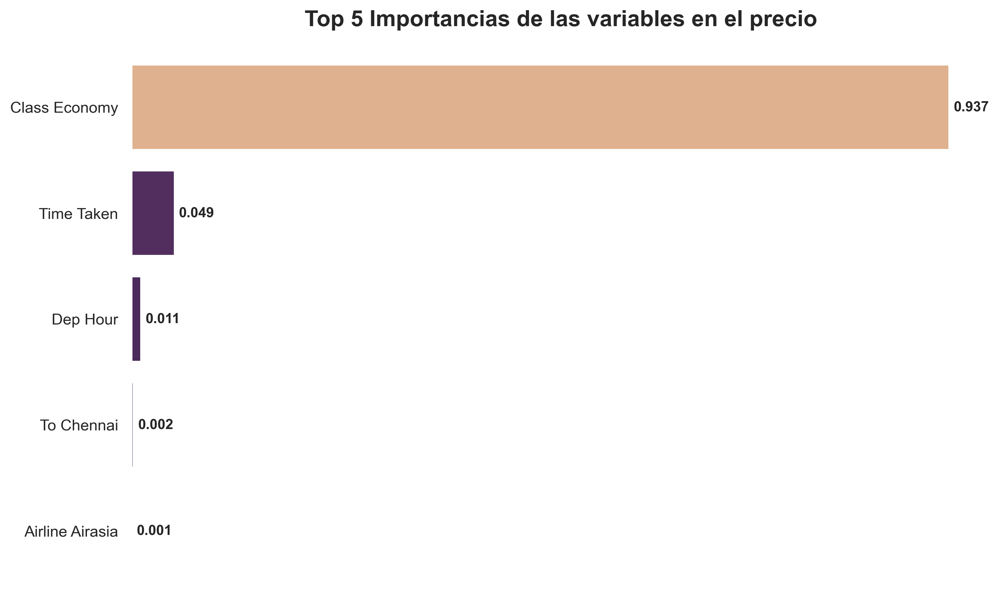
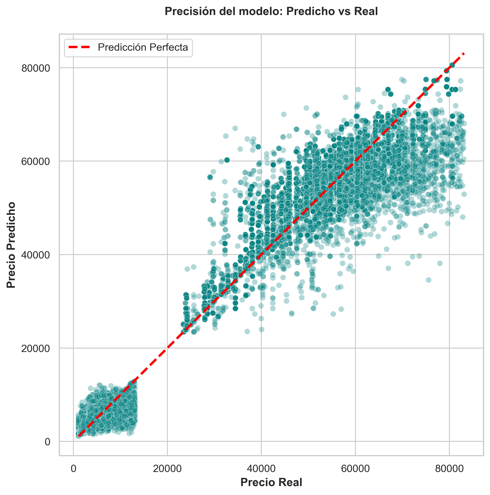

# ✈️ Predicción de Precios de Vuelos: End-to-End ML Pipeline

[](https://www.python.org/)
[](https://scikit-learn.org/)
[]()

Este proyecto aplica técnicas avanzadas de **Machine Learning** para predecir el costo de boletos de avión. Cubre el ciclo completo del análisis de datos: desde la ingesta y limpieza (ETL) hasta la optimización de modelos de ensamble para capturar la complejidad de los precios en la industria aeronáutica.

---

## 📊 Hallazgos Clave
El análisis reveló que el factor más significativo, por un margen amplio, es la **Clase de Viaje**.

### 1. ¿Qué determina el precio?
Como se muestra en el gráfico de importancia de variables, la **Clase (Económica vs. Business)** representa más del 90% del poder de decisión del modelo. Los factores secundarios incluyen la duración del vuelo y la hora de salida.



### 2. Precisión del Modelo
El modelo final optimizado muestra una fuerte correlación entre los precios reales y los predichos. El modelo funciona excepcionalmente bien para boletos de bajo costo, con un ligero aumento en la varianza para los segmentos de lujo o clase ejecutiva.



## 🚀 Rendimiento del Modelo
Tras comparar múltiples algoritmos (Regresión Lineal, Árboles de Decisión y Random Forest), el modelo de **Random Forest Optimizado** fue el que tuvo mejor rendimiento:

| Métrica | Valor |
| :--- | :--- |
| **R² Score** | 0.98 |
| **MAE** | ~1,200 |


## 🚀 Aspectos Destacados

* **🛠️ Automatización de ETL:** Diseño de una función de limpieza modular que procesa datasets de distintas clases de vuelo, garantizando la integridad de los datos y estandarizando formatos de moneda inconsistentes.
* **🧬 Feature Engineering Crítico:** * Transformación de duraciones de texto a formato numérico/temporal.
    * Extracción de componentes de tiempo (hora/día) para capturar la estacionalidad diaria y semanal.
* **🤖 Modelado Competitivo:** Comparativa entre **Regresión Lineal**, **Ridge** y **Random Forest Regressor**, utilizando optimización de hiperparámetros para maximizar la precisión.

---

## 🛠️ Stack Tecnológico

| Herramienta | Propósito |
| :--- | :--- |
| **Python** | Lenguaje principal del ecosistema de datos. |
| **Pandas / NumPy** | Limpieza profunda y manipulación de estructuras. |
| **Scikit-Learn** | Entrenamiento, validación y tunning de modelos ML. |
| **Seaborn / Matplotlib** | Visualización de correlaciones y análisis de importancia. |
| **Anaconda** | Gestión de entornos y reproducibilidad del proyecto. |

---

## 📈 Flujo de Trabajo

### 1. Preprocesamiento & Limpieza
* **Tratamiento de Nulos:** Identificación estratégica y limpieza de registros incompletos.
* **Parsing Temporal:** Conversión de marcas de tiempo en variables de alta relevancia (`Día_Viaje`, `Mes_Viaje`, `Hora_Salida`).
* **Normalización de Duración:** Conversión de formatos tipo '2h 50m' a minutos totales para facilitar el aprendizaje del modelo.

### 2. Análisis Exploratorio (EDA)
* **Análisis de Aerolíneas:** Identificación de niveles de precios por proveedor.
* **Rutas Críticas:** Evaluación del impacto del Origen/Destino en el costo final.
* **Codificación Inteligente:** Uso de `OneHotEncoding` para variables nominales y `LabelEncoding` para estructuras ordinales.

### 3. Modelado y Selección
* **Optimización:** Implementación de `RandomizedSearchCV` para ajustar `n_estimators` y `max_depth`.
* **Importancia de Atributos:** Uso de `ExtraTreesRegressor` para determinar qué variables (como el número de escalas o la clase) mueven realmente el precio.

---

## 📊 Resultados y Conclusiones

> [!TIP]
> **Insight Clave:** El modelo **Random Forest Regressor** logró identificar con precisión la brecha de magnitud entre las clases *Business* y *Economy*, permitiendo predicciones confiables incluso con la alta disparidad de precios entre segmentos.

### Performance del Modelo
| Métrica | Valor / Estado |
| :--- | :--- |
| **Algoritmo Ganador** | `Random Forest Regressor` |
| **Segmentación** | Alta precisión en nichos Premium/Economy |
| **Estado del Proyecto** | **MVP Finalizado / Listo para Despliegue** |

---

## 🔮 Roadmap: Próximos Pasos
- [ ] **Despliegue de API:** Crear un endpoint con FastAPI para predicciones remotas.
- [ ] **Dashboard Interactivo:** Interfaz en **Streamlit** para que el usuario consulte precios dinámicamente.
- [ ] **Enriquecimiento de Datos:** Integrar variables de demanda histórica y festivos nacionales.

---

## 📂 Estructura del Proyecto
```bash
├── data/               # Datasets originales y procesados
├── model/              # Modelos serializados (.pkl)
├── notebooks/          # Jupyter Notebook con el paso a paso detallado
└── README.md           # Documentación del proyecto
